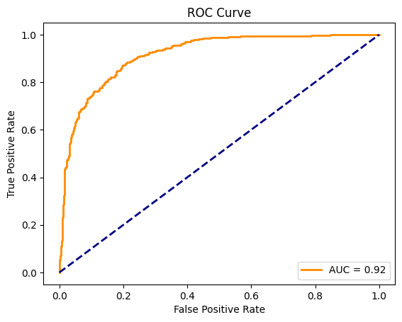

**Course:** Seminar Problems in Applied Mathematics

**Project Title:** Tennis Match Outcome Prediction with Logistic Regression

**Description:**
As part of the capstone project for my applied mathematics major at Columbia, this repository contained a machine learning model that uses logistic regression with a focus on the US Open and statistics from ATP. This section of the project is part of a broader group combining Markov chains and machine learning to forecast tennis match results.

Logistic regression is a binary classification technique that estimates the probability of a binary outcome; in this case, a match win or a match loss based on match features and player statistics from ATP and the US Open.

Given a set of match conditions and player statistics, the model predicts:
- 1 if the predicted winner is player A
- 0 if the predicted winner is player B

We used data from the Jeff Sackman Tennis Database, an open-source dataset that includes results from ATP-level tournaments dating back to 1968; however, as seen in the code, we do a lot of filtering and cleaning to not overfit.

At the heart of this technique lies the sigmoid function, that transforms real-valued numbers into probabilities, which gives us insights into the likelihood of different outcomes.The S-shaped curve, that is the sigmoid function, and it takes any numerical input and converts it into a range between 0 and 1.

$ \phi (z) = \frac{1}{1 + e^{-z}}$.

This transformation is what helps us make sense of the continuous output from logistic regression in the realm of binary decisions. So, we are dealing with labels like ‘success’ or ‘failure’ and we make an assumption about how these labels are distributed. Here, the probability of the outcome $y$ being equal to 1 i.e. a success given the input $x$ and the parameters is denoted as $h_{\omega}(x)$, while the probability of the outcome being a failure or $y$ equal to 0 is simply the complement, 1 minus $h_{\omega}(x)$:

$p(y = 1 | x; \omega) = h_{\omega}(x)$

and

$P(y = 0 | x; \omega) = 1 - h_{\omega}(x)$

where

$h_{\omega}(x) = \phi (\beta_0 + \beta_1 x_1 + \beta_2 x_2 + …)$.

Our goal is to find the best model parameters, $\omega$ and $p$ is a function of the sigmoid

$L(\omega) = \prod_{i=1}^{N} p(y_i | x_i; \omega)$,

such that

$max_{\omega} L(\omega) = max_{\omega} \prod_{i=1}^{N} p(y^{(i)} | x^{(i)}; \omega)$.

We can convert the maximization problem into minimization so that we can write the loss function. This is the logistic regression loss function used in Scikit-Learn:

L_log(ω) = -log L(ω)  
     = - ∑ᵢ₌₁ⁿ log p(y⁽ⁱ⁾ | x⁽ⁱ⁾; ω)  
     = - ∑ᵢ₌₁ⁿ [ y⁽ⁱ⁾ log p(y=1 | x⁽ⁱ⁾; ω) + (1 − y⁽ⁱ⁾) log p(y=0 | x⁽ⁱ⁾; ω) ]
     
The negative log-likelihood quantifies how well the model's predicted  probabilities align with the actual labels.

**Results:**
Our model achieved an accuracy of 92%, demonstrating its effectiveness in predicting match outcomes.

The Markov Chain model, with its focus on service point winning percentages, produced varying results with an accuracy range between 1% and 7%, attributed to the model’s inherent limitations. However, we need to observe that the logistic regression model compared the matches, and the result means that 92% of the matches are predicted correctly, while the markov model predicted the whole tournament (127 matches), so it is obvious that its accuracy will be very low compared to logistic regression model. Yet, the Markov model simplifies the complex dynamics of tennis by relying on the assumption of independence and memorylessness and fails to incorporate a multitude of influential factors like player psychology, in-game strategy adjustments, and external conditions, but logistic regression’s strength lies in its ability to incorporate multiple variables, each with an associated coefficient that directly impacts the prediction outcome. Its higher accuracy indicates a more nuanced understanding of the match dynamics, considering a wider array of factors that influence a player's performance.
